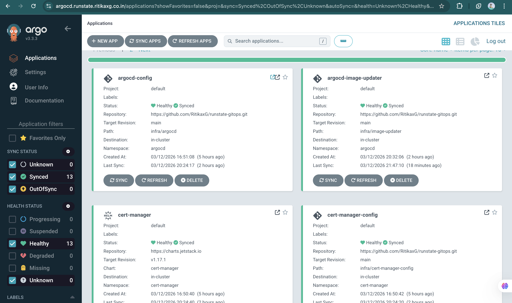
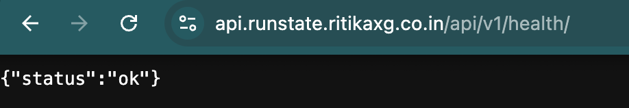
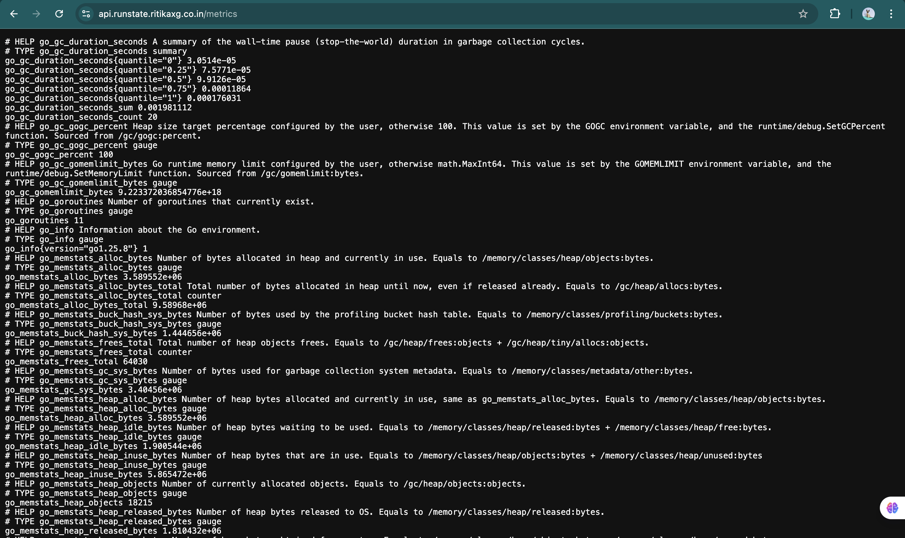
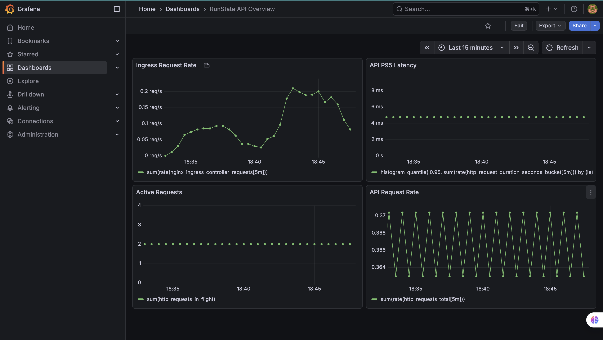
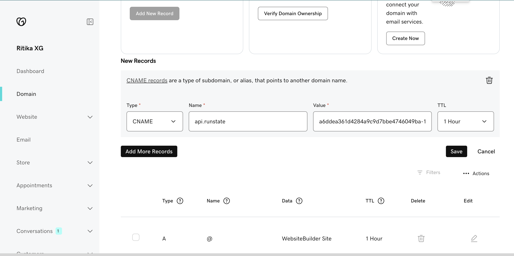
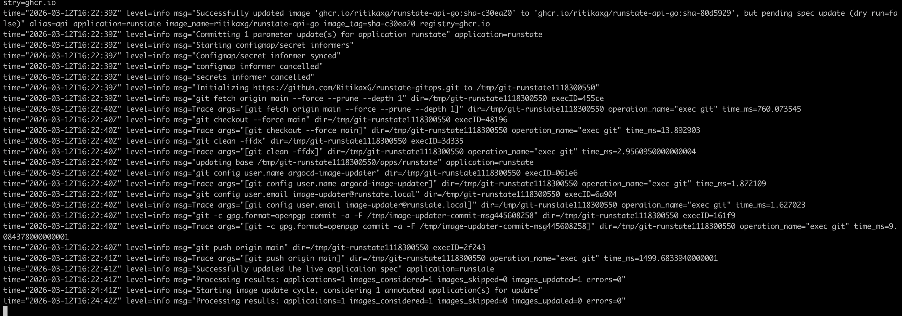

# runstate-gitops

**GitOps repository for deploying RunState to Kubernetes with Argo CD, ingress, DNS, metrics, and operational proof of deployment.**

This repository contains the declarative Kubernetes manifests used to deploy RunState through GitOps. It manages deployment state for the API, workers, secrets, ingress, autoscaling, and supporting infrastructure required to operate the system in-cluster.

---

## What it is

This repository manages the Kubernetes deployment state for **RunState**.

It includes:

- Argo CD bootstrapping,
- Kustomize-based application manifests,
- External Secrets integration,
- ingress configuration,
- metrics exposure,
- autoscaling configuration,
- image update flow,
- operational proof that the deployment is working.

This repository exists to show that the system is not only built locally, but also deployed and operated through a real GitOps workflow.

- **Main application repo:** [`runState`](https://github.com/RitikaxG/runState)
- **Deployment state repo:** `runstate-gitops`

---

## Core highlights

- **Argo CD GitOps workflow**
- **Kustomize-managed app manifests**
- **Automated deployment reconciliation**
- **Metrics endpoint exposure**
- **Grafana dashboard integration**
- **External Secrets integration**
- **Ingress + DNS-based access**
- **Health-check validation**
- **Horizontal Pod Autoscaling**
- **Production-style Kubernetes deployment flow**

---

## Architecture

This repository manages deployment for:

- **RunState API**
- **monitoring-pusher**
- **worker-monitoring**
- **worker-status-change**
- **worker-notification**
- **ConfigMap + secret wiring**
- **Ingress**
- **HPA**
- **Argo CD config**
- **Image Updater integration**

Deployment flow:

1. Changes are made in the main application repository.
2. CI builds and pushes the backend image.
3. This GitOps repository tracks deployment state and image version.
4. Argo CD reconciles the cluster to match the repository.
5. Health checks, metrics, dashboards, and DNS-backed access verify that the deployment is actually working.

---

## Key features

- Declarative Kubernetes manifests
- GitOps reconciliation with Argo CD
- Application deployment through Kustomize
- Secrets management through External Secrets
- Ingress-based routing
- Health-check validation
- Metrics exposure for observability
- Grafana-based monitoring
- DNS-backed public access
- Horizontal Pod Autoscaling

---

## Proof of deployment

This repository is intended to show evidence that the deployment workflow was implemented and working, even when the Kubernetes cluster is not being live-demoed during an interview.

### Argo CD dashboard

This screenshot shows the live Argo CD dashboard managing the deployed applications.  
It demonstrates that the GitOps workflow is active in-cluster, with applications reconciled, synced, and healthy.



---

### Health-check endpoint

This screenshot proves that the deployed application is reachable through the configured networking path and that the API is alive in-cluster.



---

### Metrics endpoint

This screenshot shows that the deployed backend exposes a metrics endpoint for observability.



---

### Grafana dashboard

This screenshot provides proof that live metrics from the deployed system are being collected and visualized.



---

### DNS / ingress proof

This screenshot shows proof of DNS resolution or successful domain-based access to the deployment.



---

### Automated Git image update

This screenshot shows the automated GitOps image update flow, where a newly built backend image is detected and the deployment manifests are updated to reflect the new version.


---

## Repo structure

```txt
runstate-gitops/
├── apps/
│   └── runstate/      # App manifests for API and workers
├── bootstrap/         # Argo CD bootstrap applications
├── infra/             # Supporting infrastructure configs
└── docs/
    └── screenshots/   # Deployment proof screenshots
```

---

## Local usage

Clone the repository:

```bash
git clone https://github.com/RitikaxG/runstate-gitops.git
cd runstate-gitops
```

Update manifests or image references, then commit and push:

```bash
git add .
git commit -m "update runstate deployment"
git push
```

Argo CD will reconcile the cluster to match the desired state stored in this repository.

---

## Related repos

- **Main application repo:** [runState](https://github.com/RitikaxG/runState)

---

## What I learned

Through this repository, I learned how to:

- separate application code from deployment state,
- structure Kubernetes manifests cleanly,
- use Argo CD as a GitOps controller,
- manage deployment state declaratively,
- integrate External Secrets into Kubernetes,
- expose metrics and health checks for operational verification,
- connect deployment with DNS, ingress, and observability,
- think not just about building software, but also about shipping and operating it.

This repository helped me understand how a backend system becomes a live, observable, continuously reconciled deployment.

---

## Status

- Argo CD setup: **implemented**
- Deployment manifests: **implemented**
- Metrics exposure: **implemented**
- Grafana integration: **implemented**
- Health-check validation: **implemented**
- DNS / ingress workflow: **implemented**
- HPA: **implemented**
- GitOps reconciliation: **working**
